# 企业AI数字员工平台

> **AI已经进入"平权化"时代，企业的"护城河"已经从模型、Agent转移到企业私域数据AI化和可利用复制能力上面。**  
> **谁能够最早/最快地将专业私域数据转化为专业数字化员工能力，谁才能长久立于AI潮流之上！**  
>                                                                —— Macro Zhao

本平台正是基于上述理念，而创建的一个能够让企业像组建真人专家团队一样组建项目需要的 AI 数字员工团队的企业级AI员工管理平台。

企业AI数字员工平台将需求、团队、智能体协作、交付与能力沉淀进行闭环，让企业快速把“想法”变成“可交付成果”的同时，沉淀可复制、分享和订阅的知识和员工模块。

## About This Project

**目前项目还处于初期阶段**，这个工程追求的是完整业务闭环：

- 从业务需求自动生成 AI 专家团队
- 在协作流程中产出可评审、可沉淀的项目交付物
- 将项目经验沉淀到知识大脑，再反哺下一轮 AI 能力升级

如果你希望做一个不仅能看、还能“落地交付”的 AI 业务平台，这个项目就是为你准备的。

## Architecture

前端基于 Vite + React + Tailwind，核心能力围绕页面工作流、数据访问层和企业知识模块展开。

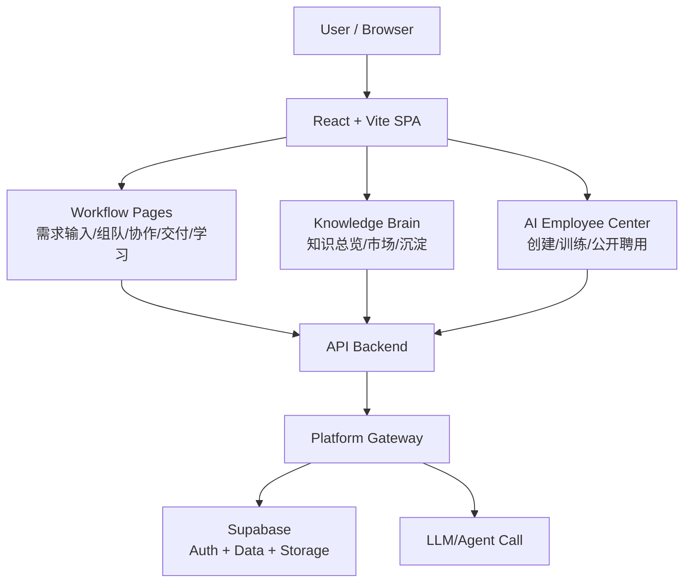

## Build & Run

### 1) Requirements

- Node.js 18+
- npm 9+

### 2) Install

```bash
npm install
```

### 3) Configure Environment

请在项目根目录创建 `.env.local`（或 `.env`），并填写：

```bash
VITE_SUPABASE_URL=your-supabase-url
VITE_SUPABASE_ANON_KEY=your-supabase-anon-key
VITE_OPENAI_API_KEY=your-openai-api-key
```

#### OrcaRouter AI（推荐）

我推荐使用 OrcaRouter AI 来做实验性或生产级的多模型/路由能力（OrcaRouter 提供灵活的模型路由、插件与平台接入）。 
详细可参考官网我的专属推荐链接（支持项目发展）： https://www.orcarouter.ai/ref/ref_4fa1c66b79aa32c0d4ea

**集成说明：**

- 在本仓库中我添加了一个轻量级的 provider：`src/lib/orcarouterProvider.js`，用于调用 OrcaRouter 的 API（端点为 `https://api.orcarouter.ai/v1`，具体请参考 OrcaRouter 官方文档并根据实际端点调整）。

- 若要启用 API 调用，请在 `.env.local` 中设置 `VITE_ORCAROUTER_API_KEY`（前端 demo 或开发环境）。生产环境建议通过后端安全代理来调用并保护密钥。

### 4) Development

```bash
npm run dev
```

默认地址：`http://localhost:5173`

### 5) Production Build

```bash
npm run build
npm run preview
```

### 6) Quality Check

```bash
npm run lint
```

## Screenshots

### Core Workflow

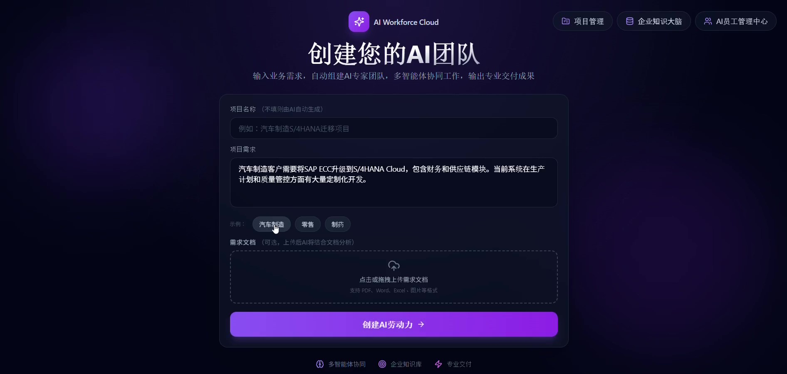
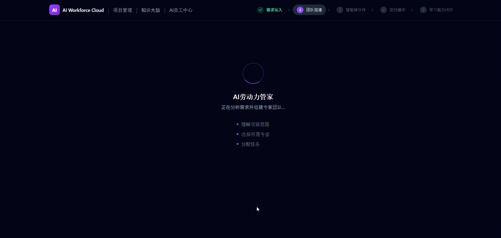
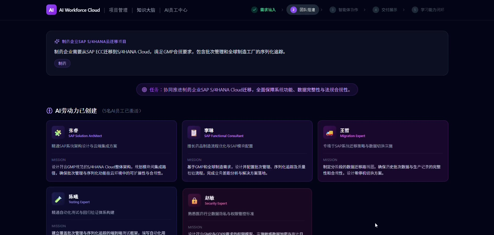
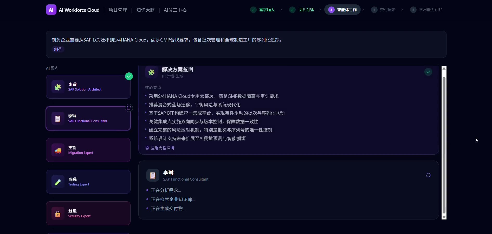
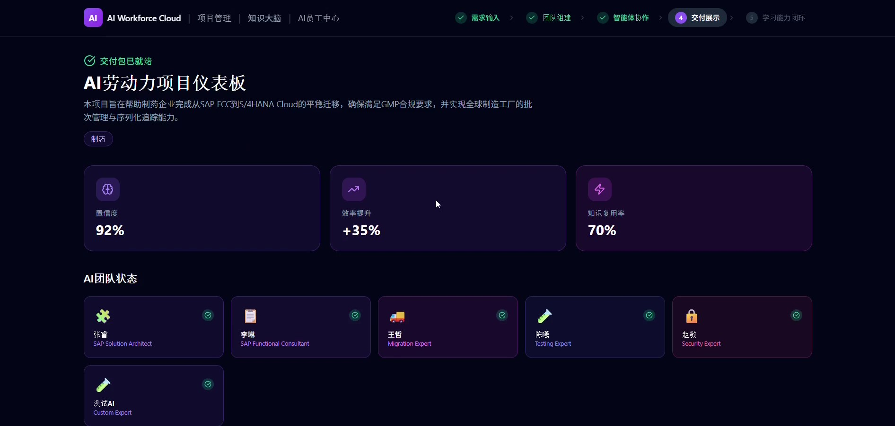

### AI Employee Center

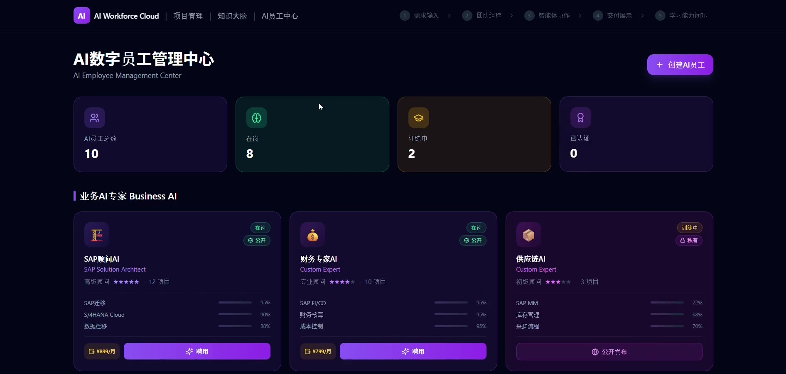
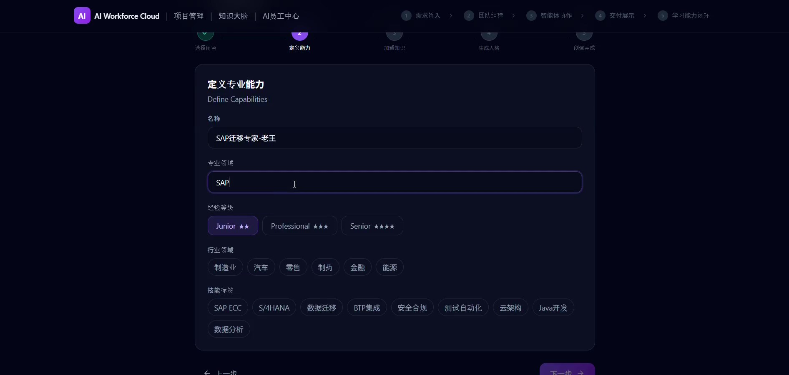
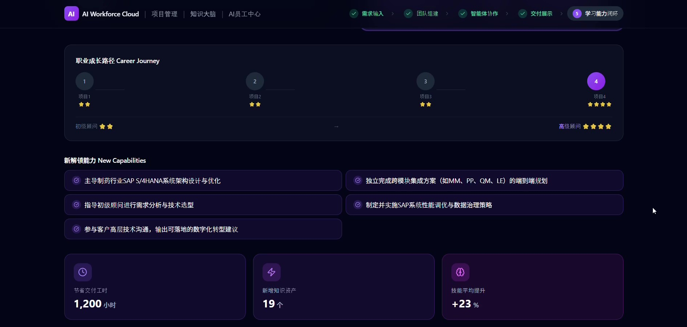
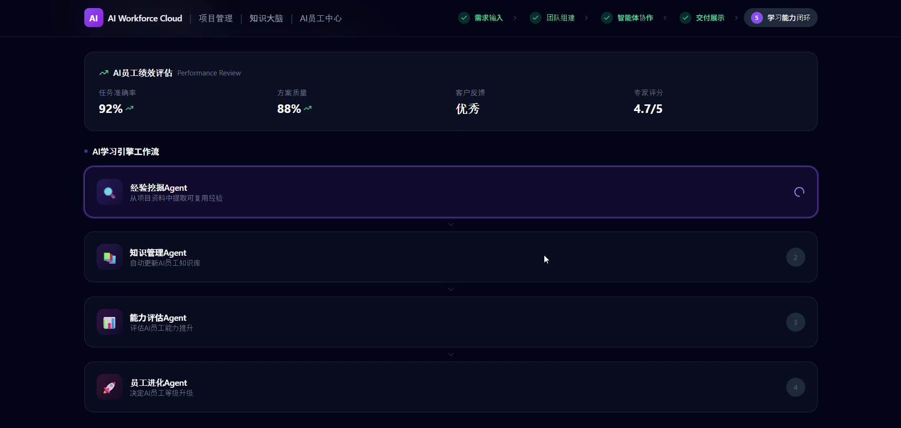
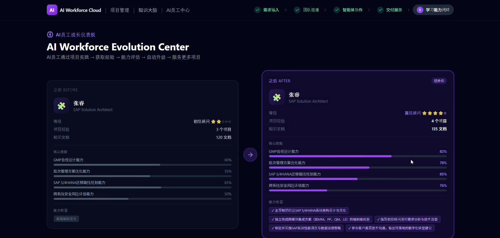
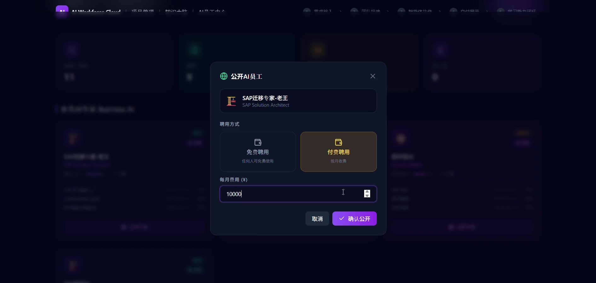

### Knowledge Brain

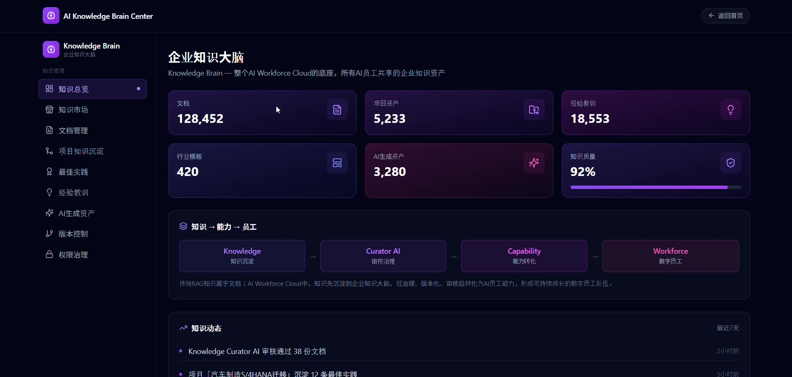
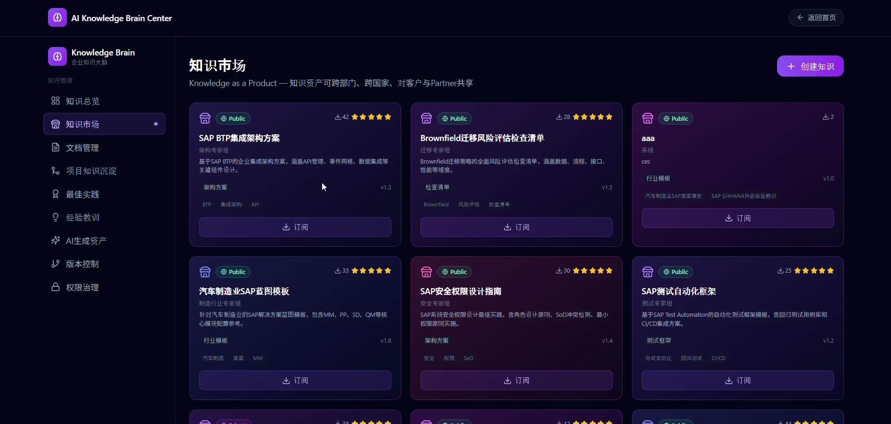
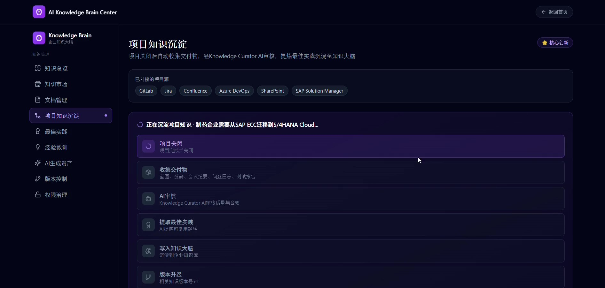
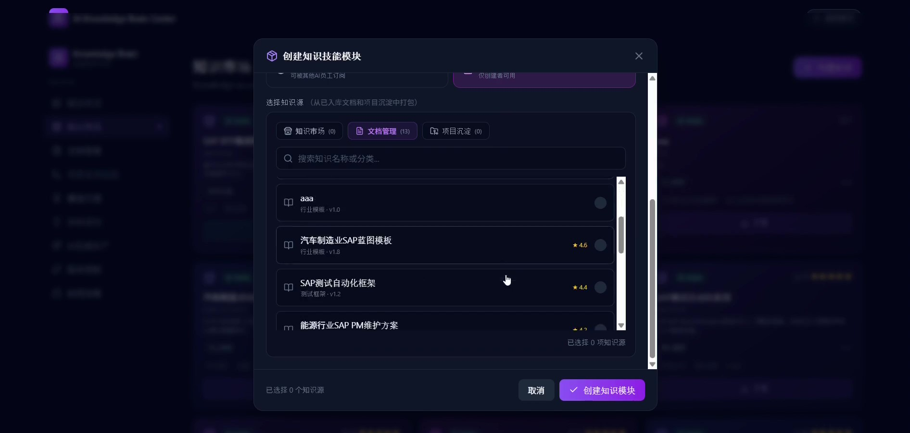

## Contributing

Welcome any contributions!
欢迎任何形式的贡献和反馈交流！

## License

本项目基于 Apache License 2.0 [LICENSE](./LICENSE)发布。